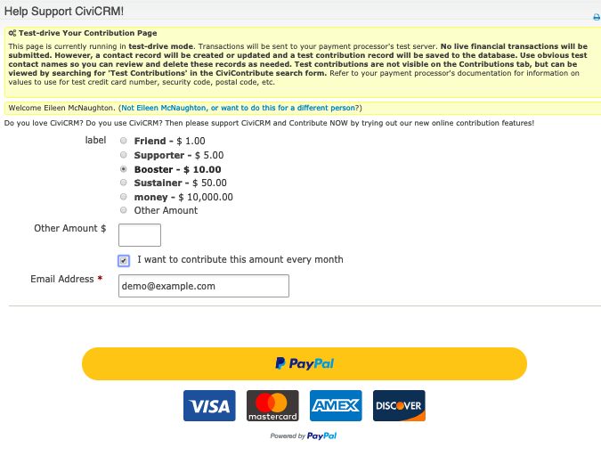
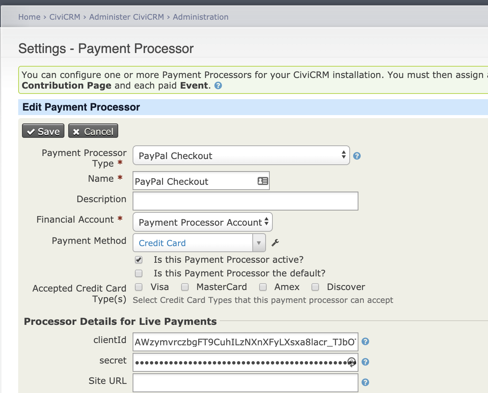

The Paypal Checkout integration adds Paypal buttons to your page which launch an authorization popup

## Advantages of Paypal checkout

1) No PCI exposure - users can pay by credit card but the credit card is
never entered on a form anywhere directly on your site
1) For US mobile users Venmo is automatically available
1) If the user's credit card expires or is otherwise cancelled and recurring payments
are set up it's likely no intervention is required. With traditional payment processing
gateways a new authorization process would be required but with Paypal it's likely the
user would themselves update their paypal credit card and there would be no follow up needed.
(This is particularly the case when the user pays more than one organization with paypal or
frequently uses it)

## Venmo
Venmo should appear automatically if the [prerequisites are met](https://help.venmo.com/hc/en-us/articles/115010455987-Getting-Started-Purchasing-with-Venmo).

In short, the following prerequisites should be met before Venmo button is visible:

    Venmo is available only in production
    Using live account
    Both buyer and seller should be in US
    Available on Mobile
    In order to see the Venmo button, the buyer has to have the Venmo app and the Venmo cookie dropped on their browser.

## Getting started
To get started you need CiviCRM 5.13+, the Omnipay extension (you can install this from 'Add Extensions' on your extensions page), a clientId and a secret key. For information on how to set these up go to   https://developer.paypal.com/docs/api/overview/#get-credentials.

Note that when it says log into dashboard there is actually a link at the top right hand corner which is what it refers to.

When you go to https://developer.paypal.com/webapps/developer/applications/myapps  andclick Create App.
 you can give it any name - the name doesn't matter

Once you have credentials you can add a payment processor as normal (Administer->CiviContribute->Payment Processors and choose add processor). Enter the credentials into this screen 

## Setting up recurring
Once you have a client id & secret key you need to request that Paypal enable reference transactions. If you have an Account Manager (AM), you should contact your account manager.  If you do not have an AM then it could take a little longer time to get it enabled.  You need [file an MTS ticket](https://www.paypal-techsupport.com/s/?language=en_US) for a non-managed account. You should request that Reference Transactions be enabled.

Once a recurring payment has been paid the payments are processed from your site's scheduled jobs. You can edit the recurring payment profile and change the date, frequency, 
amount etc through the normal edit recurring payment scheme and these will be 
respected by the scheduled job.

